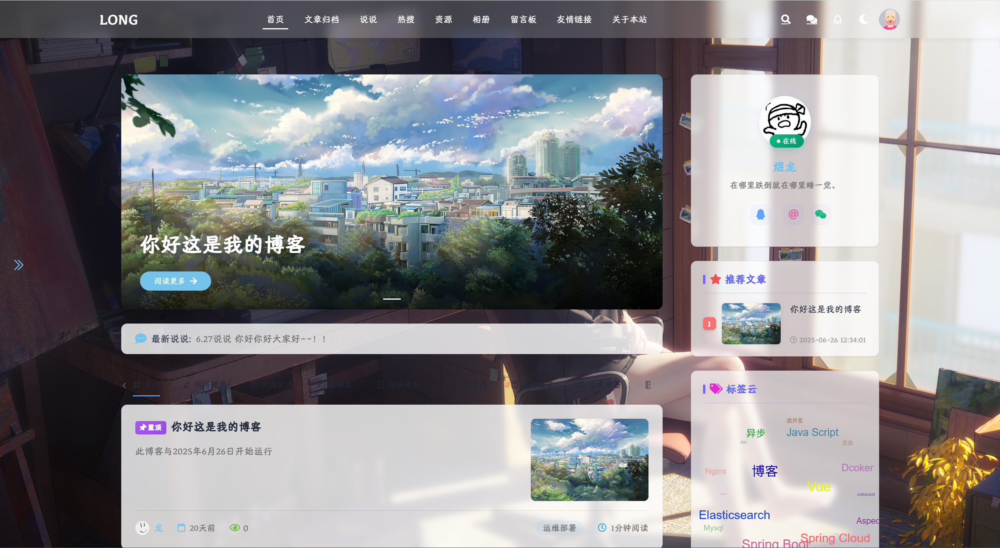

# LONG-开源博客项目 README

## 📝 项目简介

欢迎使用这个简洁优雅的开源博客系统！本博客以"生活不止眼前的苟且，还有代码和远方"为理念，旨在为创作者提供一个简洁高效的写作平台。项目已在 GitHub 开源，您可以根据自己的需求自由定制和扩展，也有后台管理功能，来管理自己发布的的文章！

[](https://github.com/yourusername/your-blog-repo)

## ✨ 主要功能

### 🚀 核心功能
- **文章管理**：支持 Markdown 富文本编辑，分类管理
- **资源中心**：整理分享学习资源、开发工具等
- **交互功能**：留言板、收藏系统和用户互动
- **热搜追踪**：实时显示热门话题和文章排行

### 🛒 特色模块
- **博客超市**：独特的资源分享平台（可替换为其他功能）
- **友情链接**：与其他博主互换链接，扩展社交网络
- **响应式设计**：适配手机、平板和桌面设备

### 🛠️ 管理功能
- 文章启用/禁用控制
- 评论审核系统
- 数据备份与恢复
- SEO 优化设置

## 🖥️ 界面预览





## ⚙️ 技术栈

- **前端**：Vue.js/React + Tailwind CSS
- **后端**：Node.js/Express 或 Python/Django
- **数据库**：MySQL/MongoDB
- **部署**：Docker + Nginx
- **其他**：Webpack, ESLint, Git

## 🚀 快速开始

### 本地开发
```bash
# 克隆仓库
git clone https://github.com/Dragon-web-max/long-blog.git

# 安装依赖
cd long-blog
cd long-blog-web
npm install

# 启动开发服务器
npm run dev
```

### 生产环境部署
```bash
# 构建生产版本
npm run build

# 启动服务
npm start
```

## 📜 许可证

本项目采用 [MIT 许可证](LICENSE)

## ☎️ 联系信息

如有任何问题或建议，请通过以下方式联系：

- 邮箱：522910252@qq.com
- 问题追踪：[GitHub Issues](https://github.com/yourusername/your-blog-repo/issues)
- 博客留言板：[在线留言](https://yourblog.com/guestbook)

---

**生活不止眼前的苟且，还有代码和远方** - 祝您编程愉快！